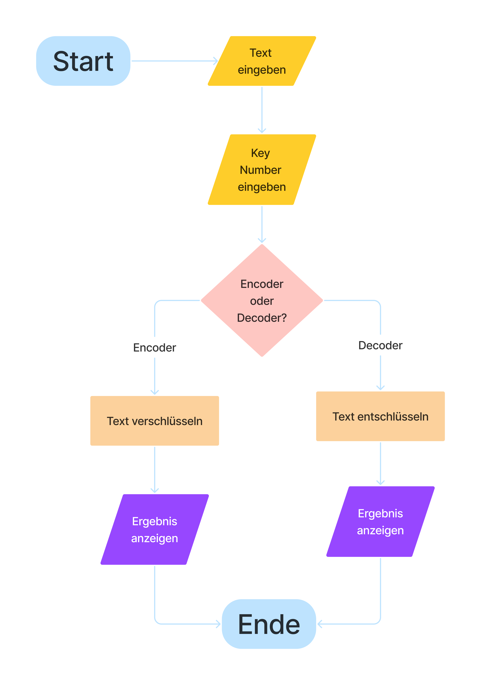

# Caesar-Verschlüsselung Projekt

## Projektübersicht

Dieses Projekt implementiert die **Caesar-Verschlüsselung** in einer Anwendung, die es Benutzern ermöglicht, Texte zu verschlüsseln und zu entschlüsseln. Die Caesar-Verschlüsselung ist ein einfaches symmetrisches Verschlüsselungsverfahren, bei dem Buchstaben im Alphabet um eine bestimmte Anzahl von Positionen verschoben werden.

## Quellcode

[TS Datai für Caesar-Verschlüsselung](https://github.com/manonsfoto/Project-TS-Caesar_cipher/blob/main/src/caesar_cipher/caesar_cipher.ts)

## Verschlüsselungslogik (Caesar-Chiffre)

Die **Caesar-Verschlüsselung** funktioniert folgendermaßen:

- Jeder Buchstabe des Klartexts wird durch einen Buchstaben ersetzt, der um eine bestimmte Anzahl von Positionen im Alphabet verschoben wurde.
- Wenn du das Ende des Alphabets erreichst (Z), geht es zyklisch bei A weiter.
- Die Anzahl der verschobenen Positionen wird durch den Schlüssel bestimmt.

.png>)

## Entschlüsselung

Die Entschlüsselung erfolgt, indem die Verschiebung um die gleiche Anzahl von Positionen, aber in umgekehrter Richtung, durchgeführt wird.

.png>)

## Technologien

- HTML
- TypeScript (TS)

## Flowchart

Das folgende Diagramm zeigt den Ablauf der Anwendung:

1. Benutzer gibt Text und Schlüssel ein.
2. Auswahl zwischen "Encoder" und "Decoder".
3. Anwendung führt die entsprechende Verschiebung durch (vorwärts für Verschlüsselung, rückwärts für Entschlüsselung).
4. Ergebnis wird im Ausgabefeld angezeigt.
